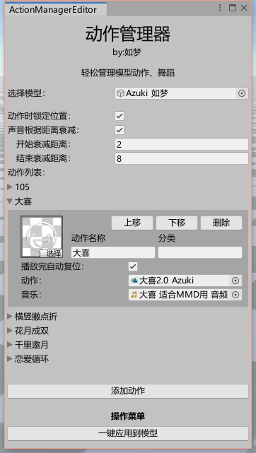

# 动作管理器

只需拖拽，就能让你轻松管理多套动作舞蹈~

## 功能说明

- 一目了然的操作方式，轻松为VRC模型添加多套动作舞蹈；
- 可分类管理多类型的动作，在VRC中显示分类菜单；
- 可自定义菜单图标，在游戏菜单中将会显示为自定义的图标；
- 可设置播放完成后是否恢复站姿状态；
- 可设置3D音量衰减，在“开始衰减距离”内是100%音量，范围内持续衰减，直到“结束衰减距离”时变为0%；
- 一键生成所需动画，并调整模型的各种参数，包括模型内的AudioSource组件，开关音乐组件的动画，Base、Action、FX这三个控制器，VRC菜单和参数；

## 使用教程

- 待更新，建议先看B站教学视频[（点击前往）](https://www.bilibili.com/video/BV1f3411s7nR)

## 注意事项

- 如果某一项动作没有添加动作文件，则判断为无效数据，这时候不会输出到模型上哦；
