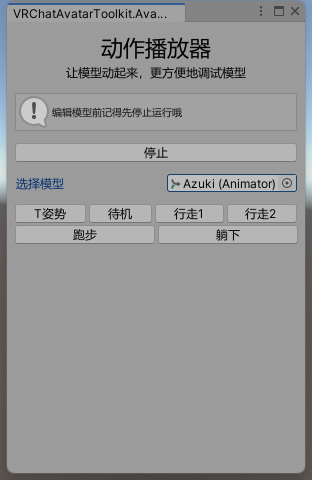
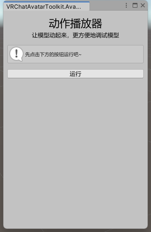

# 动作播放器

- 让模型简单地动起来，查看衣服、动骨等效果
- ps:目前动作比较少，能提供动作的可以B站私信我，万分感谢 :）

## 功能说明

- 使用本插件需要先运行场景
- 运行场景后，对组件做的修改都不会保存，请留意

## 使用教程

1. 打开动作播放器插件
2. 
3. 点击“运行”按钮，或在Unity顶端点击运行
4. 选择要控制的模型（插件会自动读取场景中第一个Avatar）
5. 随意点击一个动作按钮，然后就动起来辣
6. 
7. 使用完成后，点击“停止运行”按钮，就返回编辑模式啦

## 注意事项

- 运行场景后，对组件做的修改都不会保存，但对控制器、动画等文件会保留修改，需要留意！
- 如果想要在动作播放的情况下修改动骨参数，可以右键相应组件复制，退出播放后粘贴
