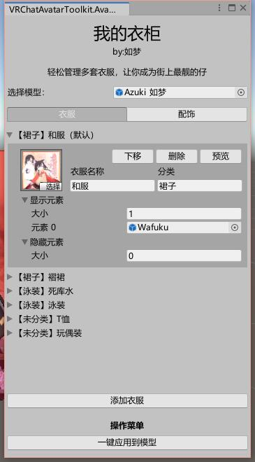

# 我的衣柜

只需拖拽，就能让你轻松管理多套衣服~

## 功能说明

- 简单管理多套衣服
- 一键导出所需的动画、控制器、VRC菜单、VRC菜单参数
- 一键将参数叠加在原有参数上，无需人工修改

## 使用教程

- 待更新，建议先看B站教学视频[（点击前往）](https://www.bilibili.com/video/BV1Su411f7KY/)

## 注意事项

- 如果模型上已经做过换装用的控制器，需要先将这个控制器停用，以防冲突
- 本插件基于VRCSDK3进行制作，不支持旧的SDK版本
