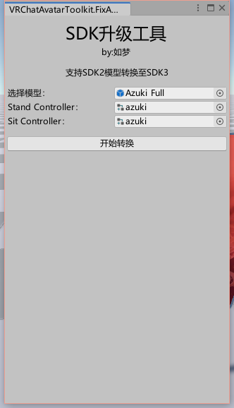
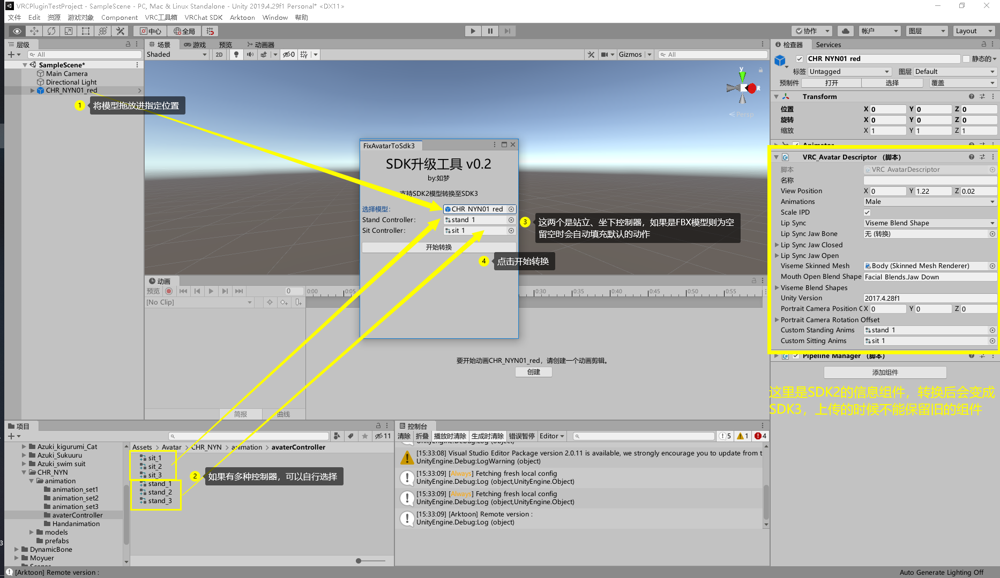
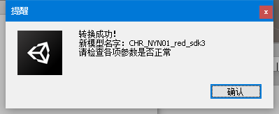
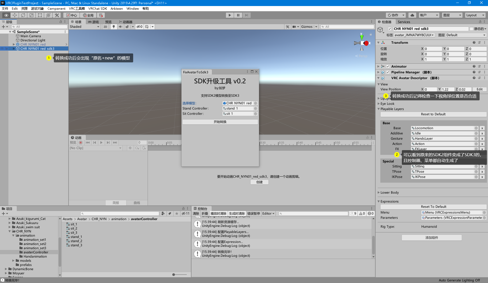
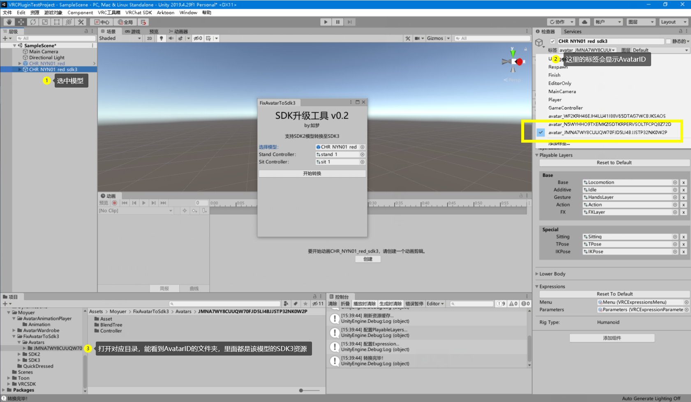

# VRC SDK 2转3

将旧的SDK2模型升级为SDK3模型，并添加所有的控制器

## 功能说明

- 支持SDK2的Prefab预制件、单一Fbx模型转换为SDK3.0
- 支持手动切换其他的Stand、Sit控制器
- 插件使用后会最大程度上保留模型原有的表情、手势、走路姿势、站姿、坐姿

## 使用教程

1. 按照图上顺序进行操作（点击可以放大查看喔）
2. 
3. 
4. 
5. 这些是转换成功的文件（小白可以无视）
6. 

## 注意事项

- 请勿将带有开关型动画的模型导入，这可能会出现问题（建议从booth上买的模型直接进行转换）
- 在上传模型前，请保证场景中没有任何SDK2模型在显示状态，否则会出现错误
