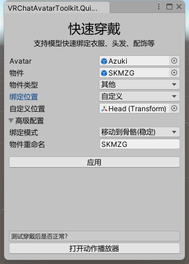

# 快速穿戴

将适配Avatar的衣服、饰品、道具等快速穿戴在Avatar身上

## 功能说明

- 打开插件时会自动选择场景中比较像Avatar和衣服的对象
- 支持两种穿戴模式：移动骨骼、父约束
- 可通过下拉框选择Avatar身上常用的骨骼位置进行绑定，也可选择自定义位置
- 在衣服选择移动骨骼的情况下，将自动转移 VRCPhysBone 组件到衣服根目录上，方便隐藏衣服同时关闭动骨

## 使用教程

1. 将需要合并的Avatar和物件拖拽进场景中
2. 调整Avatar和物件的位置，使它们的位置对齐
3. 确认物件类型，衣服选择“衣服”，头发、饰品、道具等物品可选择为“其他”
4. 如果物件类型是“其他”，则选择需要绑定的骨骼位置
5. 确认绑定模式、是否需要重命名
5. 点击“应用”按钮，就会出现一个新的模型，这个模型就带有指定的衣服啦
6. 最后可以使用 [动作播放器](../AvatarAnimationPlayer/main.md) 查看衣服效果

## 注意事项

- 绑定模式“父约束”在VRChat游戏中可能会出现不稳定的现象（比如有延迟跟随），更推荐使用“移动骨骼”的模式