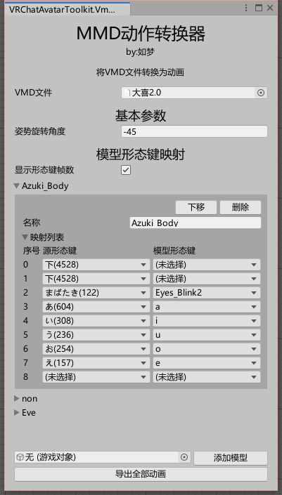
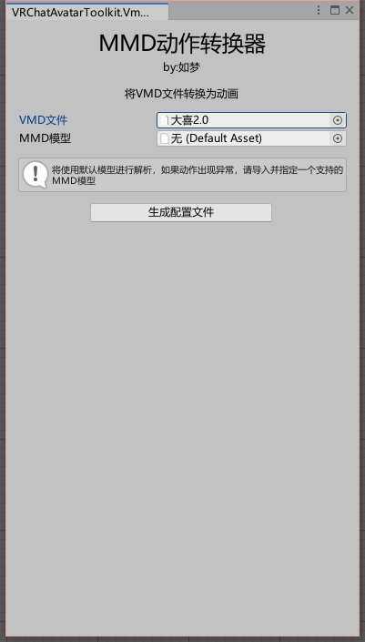
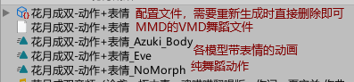

# MMD动作转换器

一键转换VMD文件为Anim文件，供Unity使用~

## 功能说明

- 一键转换VMD文件为Anim文件，供Unity使用;
- 使用PMX2FBX进行动作数据分析；
- 插件内置模型“Kinsama式初音ミクV4C”用于解析动作；
- 可根据模型，映射MMD的表情动画

## 使用教程

1. 在VRC工具箱菜单中打开MMD动作转换器；

2. 将VMD文件拖拽到Unity内，然后再拖拽放入第一行“VMD文件”处；
3. 有需要可将动作所适配的MMD模型（PMX、PMD文件）拖拽到窗口指定位置，让插件对该模型进行解析；
4. 点击生成配置文件，成功后变成下图的界面；

5. 如果需要映射MMD的表情动作，可将模型拖拽到下方选择框内，点击“添加模型”，然后为模型选择映射的形态键；
6. 点击开始转换，成功后将在VMD的同级目录下生成Anim文件，包括纯舞蹈和每个模型带表情的动画；
8. 输出文件示例：

7. 可前往B站查看教学视频[（点击前往）](https://space.bilibili.com/2562878)
   
## 注意事项

- 如果要重新生成配置文件，可将VMD文件同目录同名的Asset文件删除或重命名，再重新选择VMD文件；
- 如果导出的动作数据有异常，包括但不限于静止不动、姿势扭曲，可导入支持该VMD动作的MMD模型，在插件中指定并重新解析；
- 如果原MMD文件带有特殊表情，强烈建议导入与之对应的模型，再生成配置文件；
